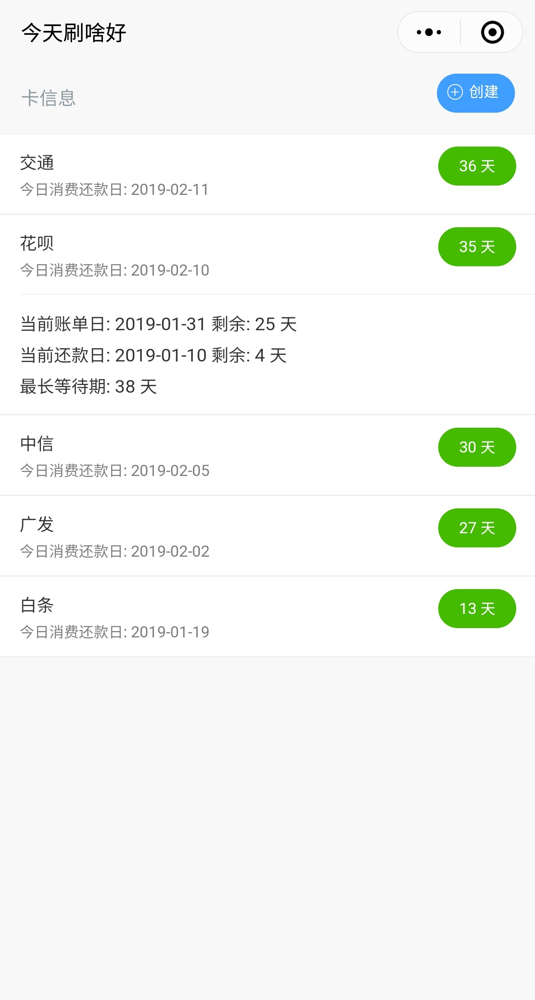
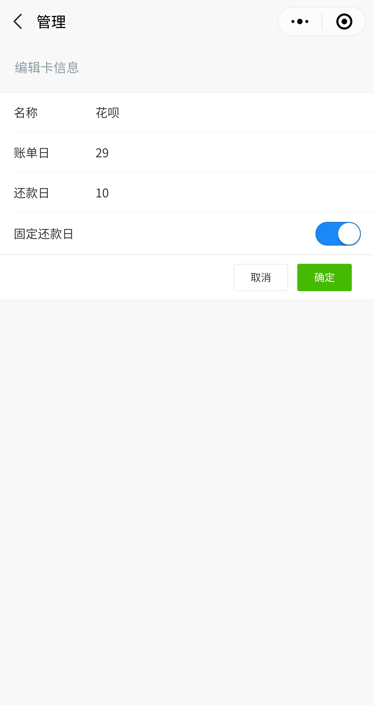

# 今天刷啥好

使用信用卡等工具消费时, 相当于银行无息借给了我们一笔资金用于此次支付. 而原本我们需要花出去的这笔钱可以先存入余额宝等货币基金当中, 等到还款日再还款给银行, 从而便赚取了一笔资金利息. 如果有多张信用卡, 以及开通了花呗, 白条等网络信用消费工具, 每次消费时选择距离还款期最长的信用卡, 便可以最大程度薅到这笔资金的羊毛.

为了快速选择还款期最长的信用卡, 顺便体验下小程序的开发流程, 制作了这款小程序 **今天刷啥好**. 用以显示信用卡的基本信息, 快速计算当日的各信用卡消费还款期限.

## 开发说明
### 小程序客户端
使用 [mpvue](https://github.com/Meituan-Dianping/mpvue) 开发, 组件库使用了 [vant-weapp](https://github.com/youzan/vant-weapp)

### 后端
使用 `go` 基于 `beego` 开发: [payback-howlong-server
](https://github.com/wanghaoxi3000/payback-howlong-server)

## 使用截图

